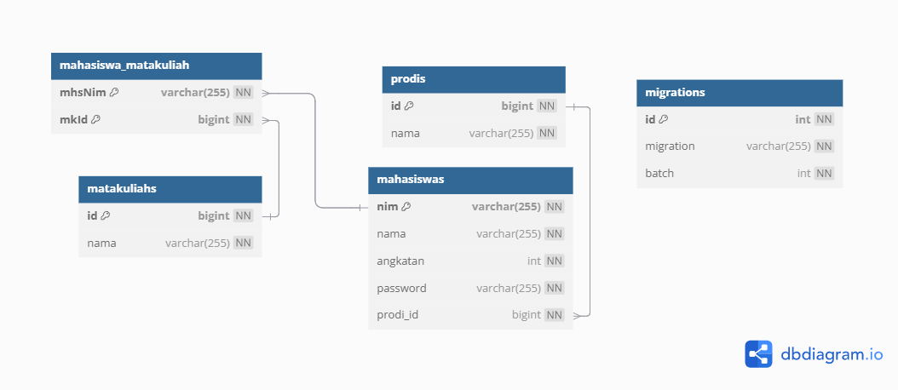
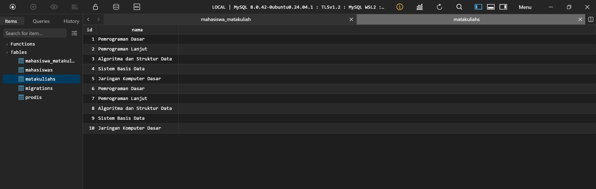

# UAP TIS

## Team Members
- Dimas Jago Aamiin

## Contribution
- Dimas: All features

## API Documentation

You can find the Postman collection for the API here: [Postman API Documentation](https://www.postman.com/research-astronaut-48598316/workspace/public/collection/37425797-e6db0e98-5f04-46e6-b749-9be059dc550b?action=share&creator=37425797)

## Presentation Video Link

[Youtube Video](https://youtu.be/7Oz8ZzsVFXE)

## Frontend code

[Github Repo](http://github.com/litegral/uap-tis-fe)

## Implemented API Endpoints

Here is a list of all the endpoints available in this application.

### General
*   `GET /`: Get application version.

### Authentication (`/auth`)
*   `POST /auth/register`: Register a new user.
*   `POST /auth/login`: Login a user.
*   `POST /auth/logout`: Logout the authenticated user.
*   `POST /auth/refresh`: Refresh authentication token.
*   `GET /auth/me`: Get authenticated user's data.

### Mahasiswa (Student)
*Requires authentication*
*   `GET /mahasiswa`: Get all students.
*   `GET /mahasiswa/prodi/{id}`: Get students by program study ID.

### Prodi (Program Study)
*   `GET /prodi`: Get all program studies. (Requires authentication)
*   `GET /public/prodi`: Get all program studies. (Public)

### Matakuliah (Course) (`/matkul`)
*Requires authentication*
*   `GET /matkul`: Get all courses.
*   `GET /matkul/saya`: Get courses taken by the authenticated student.
*   `POST /matkul/tambah`: Add a course for the authenticated student.
*   `GET /matkul/{id}`: Check if the authenticated student is registered for a specific course.

## Database schema

## SS Database

